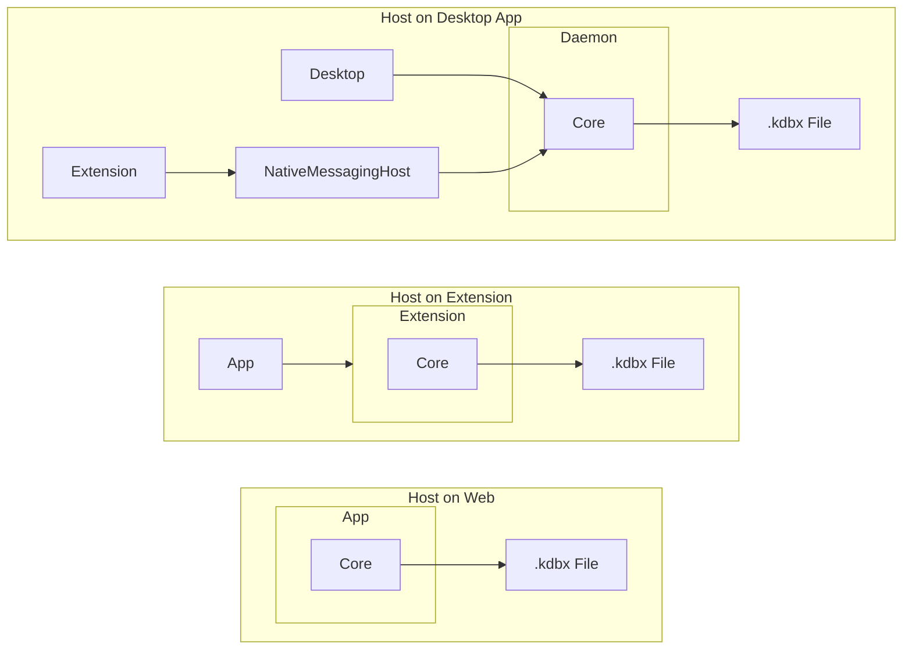

## Packages
### `@keeless/kdbx`
* kdbx4 파일 포맷 핸들링 라이브러리
* XML 구조 파싱해서 쉽게 읽고 편집 가능한 형태로
* 암후화해서 읽기 / 쓰기 가능하게
* 기본 constant들
  * https://raw.githubusercontent.com/keeweb/kdbxweb/refs/heads/master/lib/defs/consts.ts
  * https://raw.githubusercontent.com/keeweb/kdbxweb/refs/heads/master/lib/defs/xml-names.ts
* 여러가지 feature들
  * URL: (`KP2A_URL_*` 로부터 URL 읽기)
  * TOTP (https://github.com/PhilippC/keepass2android/wiki/Generating-TOTPs)
  * PassKey (`KPEX_PASSKEY_*`)

### `@keeless/sync`
* 파일 핸들 인터페이스를 정의, 읽기 / 쓰기 / 동기화
  * Atomic Update (CAS)를 지원하는 파일시스템일 경우 retry해가며 동기화

### `@keeless/core`
* 실질적인 백엔드 역할
  ```ts
  export type KeelessHost = {
    defaultApprovedKeys: ArrayBuffer[],
    storageProviders: Record<string, KeelessStorageProvider>,
    configProvider: KeelessConfigProvider // interface of simple key-value storage
  };

  export const createKeelessCore: (opts: { host: KeelessHost }) => KeelessCore;
  ```

* 기본적인 Storage Provider (WebDAV) 구현도 제공
  * https://raw.githubusercontent.com/HelloWorld017/clxdb/refs/heads/master/src/storages/webdav.ts 참고

### `@keeless/app`
* React 기반 웹 어플리케이션
* IndexedDB에 deviceKey 저장, 이 키로부터 core 인증용 키를 derive

### `@keeless/desktop`
* 지원 OS: Windows / Linux
* Daemon (deno 기반 런타임)
  * Keeless Core + Host Wrapper
  * userData (%AppData% 혹은 XDG_DATA_HOME) 에 설정 저장 (with debounce)
  * 추가 Storage Provider (localfs)
  * 15분 동안 요청 없을 시 스스로 종료
* Desktop App (tauri 기반)
  * Daemon이 켜져있지 않다면 실행시키고 IPC로 연결
  * App - Daemon간 요청을 중계하는 역할만

### `@keeless/nativemessaginghost`
* Daemon이 켜져있지 않다면 실행시키고 IPC로 연결
* stdin/stdout 으로 Daemon과의 요청을 중계
* rust로 구현

### `@keeless/build-helpers`
* 공용 vite 설정 등을 저장
* 각 패키지에서 `mergeConfig` 해서 사용

## Topology


## Protocol
* zod를 통해 엄격한 스키마 검증 수행

### Message Frame
```ts
{
  version: 1,
  timestamp: number,
  nonce: string,
  encryptionKey: string | null,
  publicKey: string,
  payload: string | null,
  signature: string
}
```
* 현재 timestamp로부터 500ms 윈도우 안에 들어오는 timestamp만 받기 허용
* 해당 윈도우 내에서는 nonce 재사용이 금지됨
  * nonce pool (len=2048) 이 가득찼다면 시간이 지나 비워지기까지 더 이상의 메세지는 받지 않음
* signature는 signature를 제외한 message frame을 stable json stringify해서 서명
* payload: null, encryptionKey: null인 경우에는 handshake
  * approved key에 없을 경우 키를 승인할 것인지 묻는 다이얼로그가 나옴
  * 승인될 경우 approved key에 추가하고 서버 측 publicKey 반환

* approved key에 있지 않고, payload가 있을 경우 drop
* signature가 맞지 않을 경우 drop
* encryptionKey를 수신자의 privateKey로 해제하고, encryptionKey로 payload를 해제
  * payload는 `{ op, args }` 구조

### Operations
* `null -> { publicKey: string }`
* `lock {} -> {}`
  * 원래 데이터베이스는 config에 지정한 시간이 경과할 경우 자동으로 잠김
  * `lock()` 은 그 전에 직접 데이터베이스를 잠금
* `unlock { password: string } -> {}`
* `getDatabaseStatus {} -> { status: 'not_exist' | 'locked' | 'unlocked' }`
* `getConfig {} -> { config: KeelessConfig }`
* `setConfig { config: DeepPartial<KeelessConfig> } -> {}`
  * 기존 config에 변경사항이 deep merge됨
* ...

## UI Design
* shadcn/ui 사용 (preset: `b1Q2La`)
* Tag, Directory - Password Entries - Entry Details 3단 컬럼 구조

